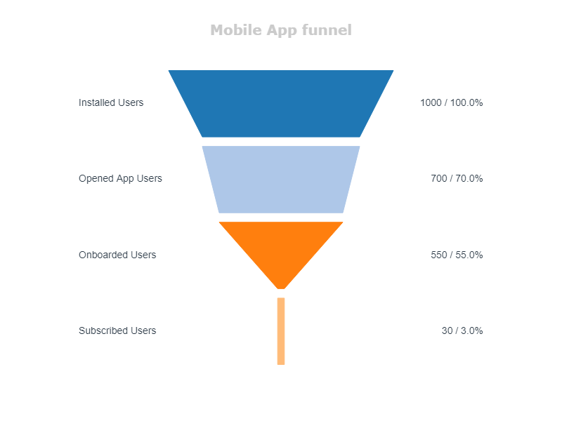

# Product funnel chart
Funnel charts are a type of chart, often used in product or marketing analytics to present, how many users achieve each stage of product.
As values you can use events to compute click-through rates, users to compute conversions or something specific for your App. For example, in e-com we sometimes compute funnels based on selling items.

## Quick start
Import the function from lib and simply add number of events/users for each stage, names of stages and chart name. Complete. You are awesome! 
```python
from product_funnel_chart.product_funnel_chart import funnel_chart

funnel_chart(
    values=[1000, 700, 550, 30], 
    phases=['Installed Users', 'Opened App Users', 'Onboarded Users', 'Subscribed Users'], 
    chart_title='Mobile App funnel'
)
```


## Arguments:
- *values* - numbers (of users)
- *phases* - name of the step
- *labels* - values displayed on chart
- *colors* - colors of your chart, by default - tableu chart colors
- *shuffle_colors* - if you want to see random colors
- *title_size* - set title size
- *font_size* - set labels font size

